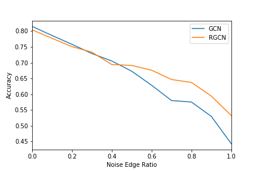

# Robust Graph Convolutional Networks Against Adversarial Attacks (Implementation)

This repository implements the paper
[_Robust Graph Convolutional Networks Against Adversarial Attacks_](https://doi.org/10.1145/3292500.3330851).

The following attacks are implemented and tested:

- [x] Random attack: generate fake edges
- [ ] RL-S2V: adversarial attack based on reinforcement learning
- [ ] NETTACK: adversarial perturbations for direct and influence attacks

The following baselines are tested:

- [x] [Graph Convolutional Networks](https://arxiv.org/abs/1609.02907)
- [ ] [Graph Attention Networks](https://arxiv.org/abs/1710.10903)

## Usage

The [random-attack.ipynb](random-attack.ipynb) notebook contains code for
training and evaluating the GCN and RGCN models under a non-targeted random
attack. [random-attack-plot.ipynb](random-attack-plot.ipynb) contains logic to
generate the plot of noise ratio to accuracy between GCN and RGCN during a
non-targeted random attack.

## Results

### Random Attack

The plot below shows the results of the RGCN model compared to the GCN model
under a non-targeted random attack from a ratio of noise to clean edges from 0
to 1 in 0.1 increments. Each increment is generated as the mean value of test
accuracies over 10 training runs for each model.

### RL-S2V Attack

TODO

### NETTACK

TODO
